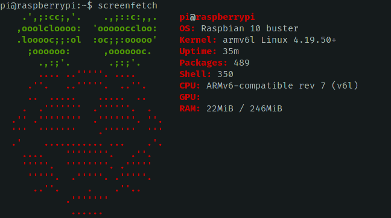
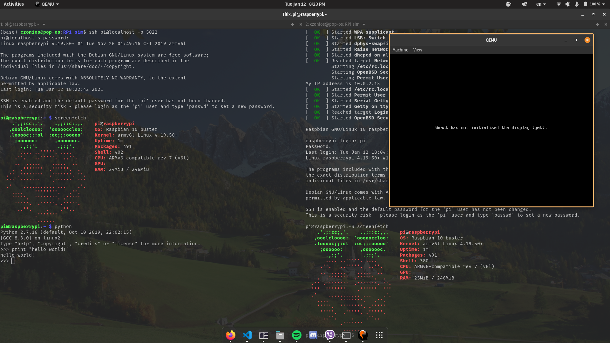

# Raspberry Pi Emulation Using QEMU

> Set up and access a Raspbian Lite image on an emulator



- [Raspberry Pi Emulation Using QEMU](#raspberry-pi-emulation-using-qemu)
  - [Installation](#installation)
    - [Required Packages](#required-packages)
    - [Check supported ARM machines and CPUs for each machine](#check-supported-arm-machines-and-cpus-for-each-machine)
    - [Emulate a Raspbian Lite image](#emulate-a-raspbian-lite-image)
  - [Usage](#usage)
    - [SSH to the emulated machine from host machine](#ssh-to-the-emulated-machine-from-host-machine)

## Installation

download the [latest release](https://github.com/czonios/RPi-sim/releases/latest) including a working Raspbian Lite image, or clone the code from the GitHub repository:

```sh
git clone https://github.com/czonios/RPi-sim.git
cd RPi-sim
```

### Required Packages

Arch Linux:

```sh
sudo pacman -S qemu qemu-arch-extra bridge-utils
```

Ubuntu / Linux Mint / Debian / Pop!\_OS:

```sh
sudo apt-get install qemu-system
```

### Check supported ARM machines and CPUs for each machine

```sh
qemu-system-arm -machine '?'
qemu-system-arm -M versatilepb -cpu '?'
```

### Emulate a Raspbian Lite image

You can run the included bash script:

```sh
bash create-run-lite.sh
```

The script works in 4 distinct parts:

1. checks for and fetches an open source qemu kernel for the Raspberry Pi
2. checks for and fetches a board-specific device tree (DTB)
3. checks for and downloads an image of Raspbian Buster Lite
4. executes the QEMU emulator

The emulation parameters are as follows:

```sh
qemu-system-arm
    -kernel ${RPI_KERNEL_FILE} \    # specify kernel file
    -cpu arm1176 \                  # use ARM 1176 as CPU
    -m 256 \                        # 256MB memory
    -M versatilepb \                # versatilepb machine
    -dtb ${PTB_FILE} \              # device tree file
    -no-reboot \
    -serial stdio \
    -append "root=/dev/sda2 panic=1 rootfstype=ext4 rw" \
    -drive "file=${RPI_FS},index=0,media=disk,format=raw" \ # boot from downloaded image
    -net user,hostfwd=tcp::5022-:22 -net nic                # enable networking and set port to 5022 for SSH
```

Once you boot into the system, you are asked to log in. Default credentials for a Raspberry Pi are:

-   username: pi
-   password: raspberry

After you log in, you need to enable and start the SSH service:

```sh
sudo systemctl enable ssh
sudo systemctl start ssh
```

Don't forget to update your Raspbian install:

```sh
sudo apt-get update && sudo apt-get dist-upgrade
```

## Usage

### SSH to the emulated machine from host machine

```sh
ssh pi@localhost -p 5022
```

That's it! You can now access the emulated machine.



<!-- ### Resizing the image

If you find you need more space in your Raspbian image, you can use the following steps:

* Check available space using
```sh
df -h
```

* Resize the image

```sh
qemu-img resize  +10G
``` -->
